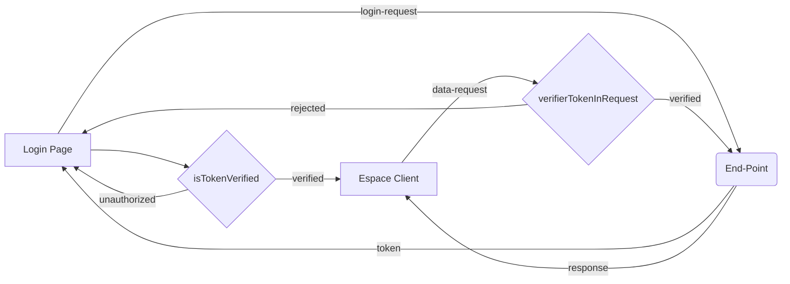

# Bienvenue sur FeedBack-ipssi Frontend!

Ce projet est une application web construite avec la librairie Javascript, ReactJS. cette application sert d'interface avec laquelle l’école ipssi peut créer des modules, inscrire des élèves à une promotion et assigner des intervenants à des modules créés. Les élèves qu'an à eux peuvent depuis cette interface noter leur intervenant et laisser un commentaire sur le module donné. Ceci permettra à l’école d’avoir un meilleur suivis des intervenants qu'elle ramène et poussera donc une amélioration au long terme.

## Parcours Utilisateur

*si le schéma n’apparaît pas correctement veuillez utiliser un markdown editor comme [stackedit.io](https://stackedit.io/)*

le schéma ci-dessus démontre le parcours de l'utilisateur tout le long de l'application. Une fois que l'utilisateur a login, il sera redirigé par rapport a son rôle. 

Dans le cas où c'est un **admin** il arrivera sur un dashboard qui lui montrera tous les étudiants, les modules, et les promotions. Depuis cette interface la il sera en mesure d'ajouter, de supprimer ou de modifier les différentes entités mentionnées. Par contre il n'aura que la lecture des notes accessible le permettant ainsi à l’école de voir les notes données aux intervenants sans pouvoir les modifier.  

Dans le cas où c'est un **élève** il arrivera sur un dashboard lui affichant les modules dans lesquels il participe. il pourra alors voir la note qu'il leur a attribuée, si elle existe, et pourra aussi noter un certain module et lui ajouter un commentaire.  

Dans le cas où c'est un **intervenant** il arrivera sur un dashboard affichant les modules qu'il enseigne. il pourra donc voir la note qui lui a était attribue pour éventuellement améliorer ou pas sa pédagogie.  

L'utilisateur peut depuis n'importe quel page décidé de "logout", il sera donc redirige vers le login-page

## Sécurité
Lors du login l'utilisateur reçoit un jeton d'authentification qui sera stocké dans le localStorage. ce jeton-là est responsable d'authentifier l'utilisateur lors de ses différents appels à l'api. Tant que le jeton sera valable l'utilisateur restera dans son l'espace et accédera aux données qui lui sont autorisées. le schéma ci-dessous démontre l'utilisation du jeton tout au long d'une session utilisateur.

*si le schéma n’apparaît pas correctement veuillez utiliser un markdown editor comme [stackedit.io](https://stackedit.io/)*

Comme le démontre le schéma ci-dessus au moment du login l'utilisateur reçoit un jeton qui lui permettra d’accéder à l’espace client. De plus, une fois a l’intérieur chaque requête émise par le client sera vérifiée, dans le cas où le jeton est valide. le client pourra communiquer avec le serveur, sinon il sera automatiquement rejeté sur le login page et devra saisir une nouvelle fois ses identifiants.

